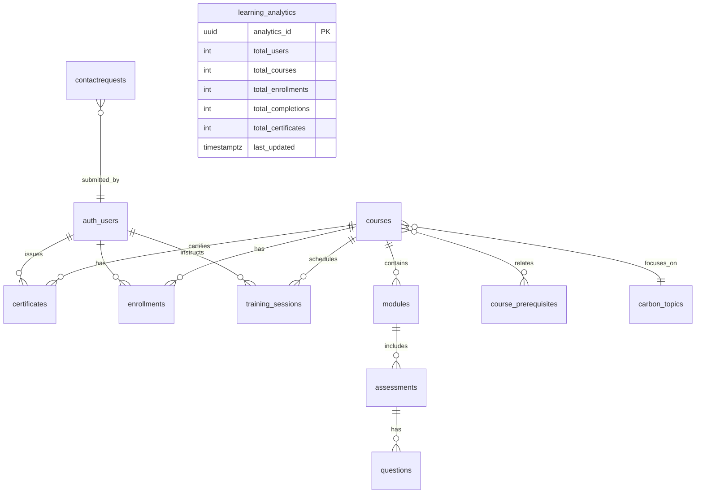
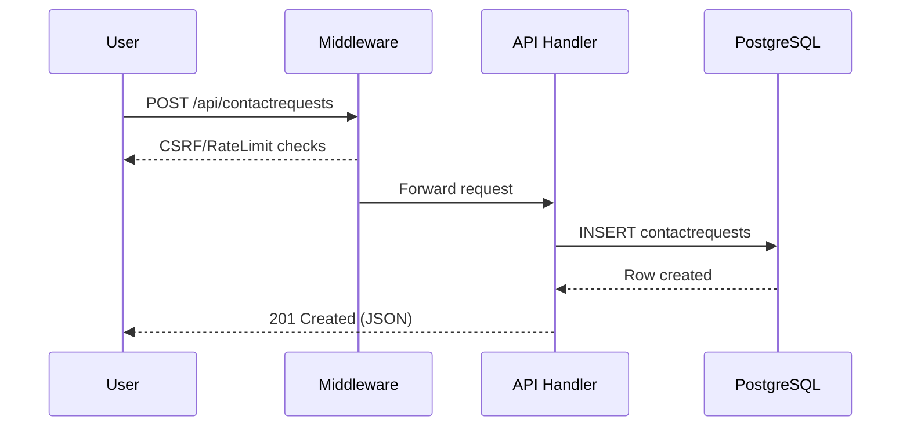

# Fullstack Web Development Internship Report — CarbonJar

Date: 2025-10-06  
Intern: <Your Name>  
Mentor: <Mentor Name>

## 1. Introduction

This report documents my fullstack web development internship work on CarbonJar, a Next.js 15 application with React 19 and a PostgreSQL backend. It covers the architecture, development workflow, database design, API endpoints, security, testing, and deployment practices, and concludes with learnings and next steps.

## 2. System Architecture

### 2.1 High-level architecture

```mermaid
flowchart LR
  subgraph Client [Client]
    Browser[Browser (React 19, App Router)]
  end

  subgraph NextApp [Next.js 15 App]
    Pages[App Router Pages & Layouts]
    API[Route Handlers /api/*]
    Middleware[Auth + CSRF + Rate Limit]
  end

  subgraph Services [Back-end Services]
    Clerk[Clerk (Auth)]
    Postgres[(PostgreSQL\nDrizzle ORM)]
    Upstash[Upstash Redis\n(optional)]
    Neon[Neon Serverless Driver]
  end

  Browser -- HTTPS --> NextApp
  NextApp -- JWT/OIDC --> Clerk
  API -- SQL via Neon --> Postgres
  Middleware -- sliding window --> Upstash
```

### 2.2 Request lifecycle

1. Request enters `middleware.ts` for route protection, CSRF checks, and rate limiting.
2. Public routes pass through; protected routes require Clerk session.
3. API handlers use Drizzle ORM to query PostgreSQL via Neon or `pg` client.
4. Response returns JSON (API) or SSR/SSR+CSR rendered HTML.

## 3. Tech Stack

- Frontend/SSR: Next.js 15, React 19, TypeScript 5, Tailwind v4
- Auth: Clerk (middleware, session, role checks)
- Data: PostgreSQL, Drizzle ORM, Neon serverless driver
- Rate limiting: Upstash Redis (optional); in-memory fallback for dev
- Testing: Jest 30 + @testing-library/react + jest-dom
- CI: GitHub Actions (Node 20): lint → typecheck → test
- Docs: OpenAPI 3.1 (`openapi.yml`), served at `/api-docs`

## 4. Database Design

### 4.1 Entity overview

Key entities include: `auth_users`, `courses`, `modules`, `assessments`, `questions`, `certificates`, `enrollments`, `training_sessions`, `contactrequests`, `notifications`, `carbon_topics`, `learning_analytics`.

### 4.2 ER Diagram



## 5. Backend APIs

- Contact Requests: `GET /api/contactrequests`, `POST /api/contactrequests`
- Trainings (Courses): `GET /api/trainings`, `POST /api/trainings`
- Webhooks (Clerk): `/api/webhooks/*`
- More route groups scaffolded under `app/api/*` (assessments, certificates, etc.)

Example: Contact request submission flow



## 6. Security and Compliance

- Middleware security headers and CSP in `next.config.ts`
- Clerk middleware route protection; `lib/auth.ts` role guard helper
- CSRF origin/referrer checks (except webhooks)
- Rate limiting via Upstash or in-memory fallback
- Input escaping helper in `lib/xss.ts`
- Env validation via `lib/env.ts` (Zod)

## 7. Frontend Implementation

- App Router pages in `app/*` with layouts and shared `ClientLayout.tsx`
- Tailwind v4 with tokens in `app/globals.css`, custom fonts and animations
- Components organized by feature: `components/*`
- Images from whitelisted domains (Next Image config)

## 8. Testing and CI

- Jest 30 with jsdom; setup in `jest.config.js` and `jest.setup.js`
- Example tests: component render assertions and link URL checks
- GitHub Actions CI (`.github/workflows/ci.yml`) on Node 20

## 9. Development Workflow

- Local: `npm run dev` with Turbopack
- Code Quality: ESLint 9, Prettier 3 + tailwind plugin, Husky + lint-staged
- DB: Drizzle schema-first; migrations under `migrations/*`

## 10. Deployment Notes

- Required env: `DATABASE_URL`, `CLERK_SECRET_KEY`, `NEXT_PUBLIC_CLERK_PUBLISHABLE_KEY`
- Optional: Upstash Redis envs for rate limiting
- Ensure proxy/CDN preserves IP headers (`x-forwarded-for` / `x-real-ip`)
- Confirm Next image remotePatterns for external assets

## 11. Learnings and Contributions

- Implemented secure POST handling with rate limiting and input sanitization
- Added trainings creation flow with role-based authorization
- Improved documentation and automated PDF generation with Mermaid diagrams

## 12. Next Steps

- Standardize on Neon HTTP adapter across all routes
- Add schema validation for request bodies
- Expand OpenAPI spec to cover all routes and error models
- Introduce e2e tests (Playwright) for auth and critical flows

## 13. Appendix

- Key files: `middleware.ts`, `lib/db/schema.ts`, `lib/db/drizzle.ts`, `lib/auth.ts`, `openapi.yml`
- Docs: `docs/Technical-Report.md`, `docs/Fullstack-Internship-Report.md`
